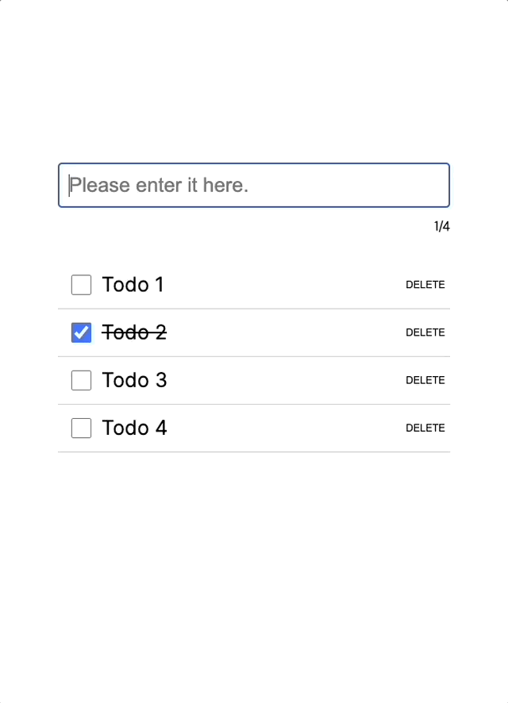

# nextjs-todo-app-with-react-render-state-hook

This project is a sample project configured with the [react-render-state-hook](https://www.npmjs.com/package/react-render-state-hook). By leveraging the [react-render-state-hook](https://www.npmjs.com/package/react-render-state-hook) library, it allows sharing data and rendering state globally, also enabling the rendering of screens based on data processing states. Additionally, you can change data processing in Storybook.

